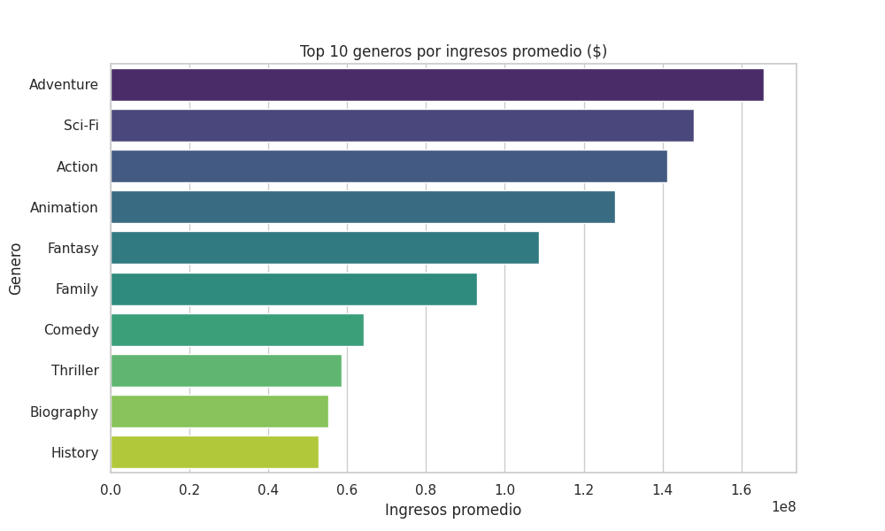
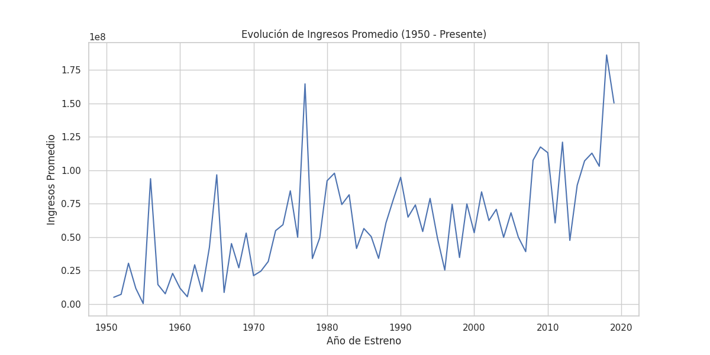
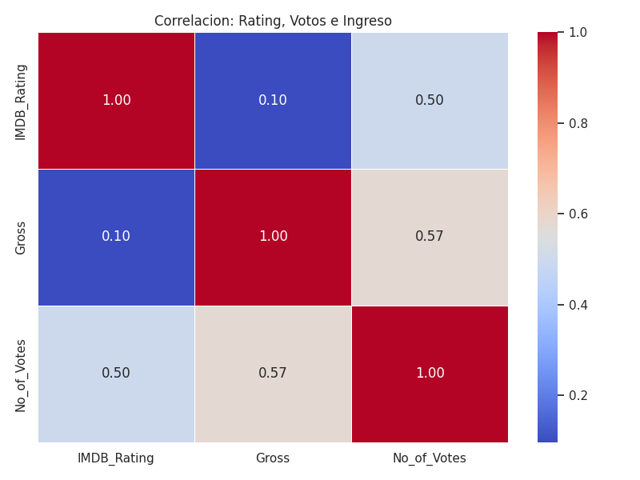
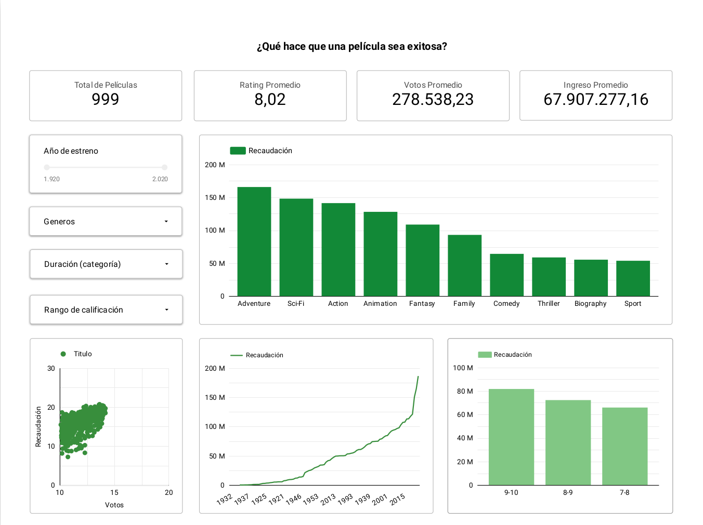

# IMDb Movies Data Analysis 

## 📊 Project Overview
This project analyzes the IMDb Movies dataset to understand what drives a movie’s commercial success.

An end-to-end workflow was built using:

  - Python (data cleaning & feature engineering)
  - SQL (analytical queries with SQLite)
  - Looker Studio (interactive dashboard)

---

## 🎯 Business Questions
1. What makes a movie generate more revenue?
2. Which genres combine high revenue and strong ratings?
3. Do genres with more movies generate more revenue per film?
4. What combination of duration, rating, and genre appears in successful movies?
5. What factors best explain audience engagement (votes)?
6. Which actors consistently appear in successful movies?
7. How have revenue, ratings, and production evolved over time?

---

## 🗂 Dataset
- Source: Harshit Shankhdhar
- Name: IMDB Movies Dataset

---

## ⚙️ Methodology
### 1. Data Cleaning (Python)
 - Converted key variables to numeric (Gross, Runtime, Votes, Year)
 - Removed invalid or null values
 - Handled missing data (median imputation for Meta_score)
 - Created new features:
      - Rating_Bucket (<7, 7–8, 8–9, 9-10)
      - Runtime_Bucket (Short, Medium, Long, Very Long)
 - Normalized genres (one row per movie-genre)

---

### 2. Data Storage
 - Cleaned data stored in SQLite database
 - Two main tables:
      - imdb_top (main dataset)
      - imdb_genre_dashboard (normalized genres)

---

### 3. SQL Analysis
  - Aggregations (AVG, COUNT, COUNT DISTINCT)
  - Segmentation using buckets
  - Genre profitability analysis
  - Correlation exploration (votes vs revenue)
  - Time-based trends

---

### 4. Visualization
Python (Seaborn / Matplotlib):
  #### Top Genres by Revenue
  This chart highlights which genres generate the highest average revenue.
  

  #### Revenue Evolution Over Time
  Shows how average movie revenue has changed across years.
  

  #### Correlation Analysis
  This heatmap explores relationships between rating, votes, and revenue.
  

---

## 📊 Exploratory Visualizations

🔗 **View Interactive Dashboard:**  
https://datastudio.google.com/reporting/9c8f579c-9cda-4b5b-b76b-c29d45737511

---

## 🔍 Key Insights
  - Popularity drives revenue
    Movies with more votes tend to generate higher revenue.
    → Votes are used as a proxy for audience engagement.
  - Only top-rated movies (9+) significantly outperform
    Ratings below 9 show relatively similar revenue levels.
    → Exceptional quality stands out, average does not.
  - Mass entertainment genres dominate revenue  
    Adventure and Sci-Fi lead in both revenue and ratings, making them strong commercial bets.
  - More movies ≠ more profit per movie
    Producing more titles in a genre does not guarantee higher average revenue.
  - Genre matters more than duration
    Duration has some effect, but genre is a stronger driver of success.

---

## 🛠 Technologies Used
- Python
- Pandas
- Matplotlib
- SQLite
- Seaborn
- Looker
